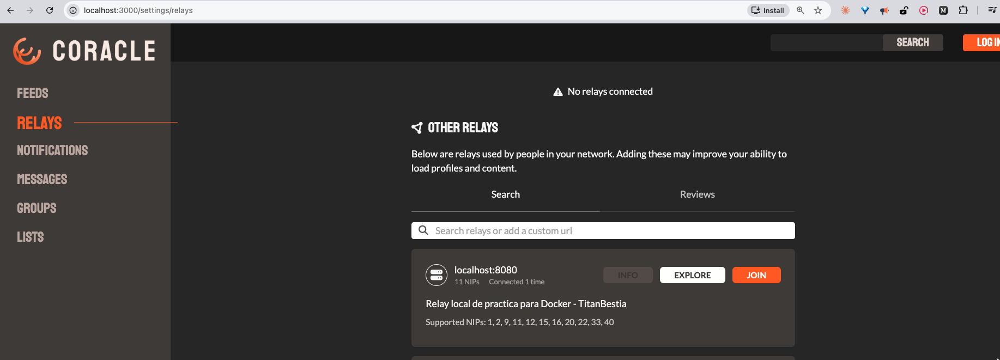

# Infraestructura Nostr sobre Docker

Despliegue automatizado de un **relay Nostr** y un **cliente web**, ambos en
contenedores conectados a una misma red Docker, usando únicamente comandos de
Docker (sin Docker Compose).

| Componente  | Imagen                   | Puerto interno | Puerto en el host |
| ----------- | ------------------------ | -------------- | ----------------- |
| Relay       | `scsibug/nostr-rs-relay` | `8080`         | `8080`            |
| Cliente web | `bracr10/coracle`        | detectado auto | `3000`            |
| Red         | `nostr-net` (bridge)     | —              | —                 |

El cliente web queda accesible en **http://localhost:3000** y el relay en
**ws://localhost:8080**.

---

## Requisitos previos

- Docker Engine 20.10 o superior (`docker --version`).
- El demonio de Docker corriendo y el usuario con permisos para usarlo
  (grupo `docker`, o ejecutar con `sudo`).
- `bash` y, opcionalmente, `curl` (se usa para verificar que los servicios
  respondan; si no está, el despliegue igual funciona).
- Puertos `3000` y `8080` libres en la máquina anfitriona.

---

## Contenido del repositorio

```
.
├── deploy.sh     # despliegue: red + imágenes + contenedores
├── cleanup.sh    # limpieza: contenedores + red
├── config.toml   # configuración del relay (descripción personalizada)
└── README.md
```

---

## Orden de ejecución

### 1. Personalizar `config.toml`

Editar la línea `description` y reemplazar `TU_USUARIO_GITHUB` por el usuario
propio de GitHub. Debe quedar exactamente así:

```toml
description = "Relay local de practica para Docker - miusuario"
```

`deploy.sh` aborta si la línea sigue con el placeholder o no respeta el
formato, así que no se puede desplegar sin personalizarla.

### 2. Dar permisos de ejecución

Un `.sh` recién creado no es ejecutable; sin esto el sistema responde
`Permission denied`.

```bash
chmod +x deploy.sh cleanup.sh
```

### 3. Desplegar

```bash
./deploy.sh
```

El script, en orden:

1. Verifica Docker, el `config.toml` y que los contenedores no existan ya.
2. Crea la red `nostr-net` (si no existe).
3. Hace `docker pull` de ambas imágenes.
4. Levanta el relay con `docker run -d`, publicando `8080:8080` y montando
   `config.toml` en `/usr/src/app/config.toml` dentro del contenedor.
5. Espera a que el relay responda (pausa + reintentos con `curl`).
6. Levanta el cliente con `docker run -d`, publicando `3000:<puerto interno>`.
   El puerto interno se lee de la propia imagen con `docker image inspect`
   en lugar de asumirlo.
7. Espera a que el cliente responda y muestra el estado final.

### 4. Verificar (evidencia de la práctica)

1. Abrir **http://localhost:3000** en el navegador.
2. En la barra lateral izquierda, entrar a **Relays**.
3. Agregar o ubicar el relay `ws://localhost:8080` y pulsar **Info**.
4. Debe verse la descripción configurada:
   `Relay local de practica para Docker - miusuario`.

Verificación equivalente desde la terminal (documento NIP-11 del relay):

```bash
curl -H "Accept: application/nostr+json" http://localhost:8080
```

### 5. Limpiar

```bash
./cleanup.sh
```

Detiene y elimina ambos contenedores, borra la red y lista contenedores,
redes y volúmenes para comprobar que no quedó nada.

Los scripts están separados a propósito: la limpieza se ejecuta muchas veces
durante las pruebas y `deploy.sh` falla si los contenedores ya existen, por lo
que limpiar es el paso previo natural para volver a empezar.

---

## Personalización

Las variables se pueden sobrescribir por entorno sin tocar el código:

```bash
RELAY_HOST_PORT=7000 CLIENT_HOST_PORT=8000 ./deploy.sh
RELAY_HOST_PORT=7000 CLIENT_HOST_PORT=8000 ./cleanup.sh
```

> Si se cambia `RELAY_HOST_PORT`, actualizar también `relay_url` en
> `config.toml` (`ws://localhost:<puerto>/`), que es la URL con la que el
> relay se anuncia a los clientes.

---

## Evidencia

### 1. Descripción visible desde el cliente web



En `http://localhost:3000/settings/relays` aparece el relay `localhost:8080`
con la descripción definida en `config.toml` y el estado `Connected`.

### 2. Documento NIP-11 del relay

```console
$ curl -H "Accept: application/nostr+json" http://localhost:8080
{
  "id": "ws://localhost:8080/",
  "name": "relay-docker-TitanBestia",
  "description": "Relay local de practica para Docker - TitanBestia",
  "supported_nips": [1, 2, 9, 11, 12, 15, 16, 20, 22, 33, 40],
  "software": "https://git.sr.ht/~gheartsfield/nostr-rs-relay",
  "version": "0.10.0",
  "limitation": {
    "payment_required": false,
    "restricted_writes": false
  }
}
```

El campo `description` confirma que el relay levantó con el `config.toml`
montado desde el repositorio.

### 3. Limpieza del entorno

```console
$ ./cleanup.sh
[✓] 'nostr-client' eliminado.
[✓] 'nostr-relay' eliminado.
[✓] Red 'nostr-net' eliminada.

$ docker ps -a
NAMES     IMAGE     STATUS

$ docker network ls
NETWORK ID     NAME      DRIVER    SCOPE
9cdae976c158   bridge    bridge    local
afc64d7c9f18   host      host      local
fa261722c296   none      null      local
```

El entorno volvió a su estado inicial.
